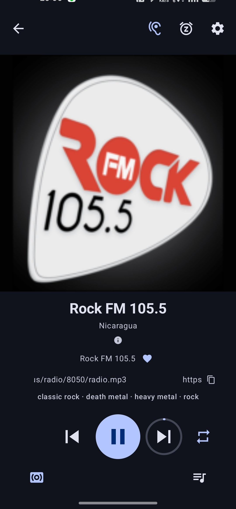
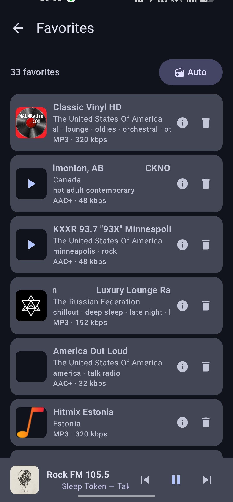
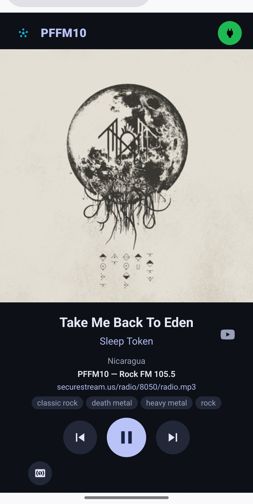
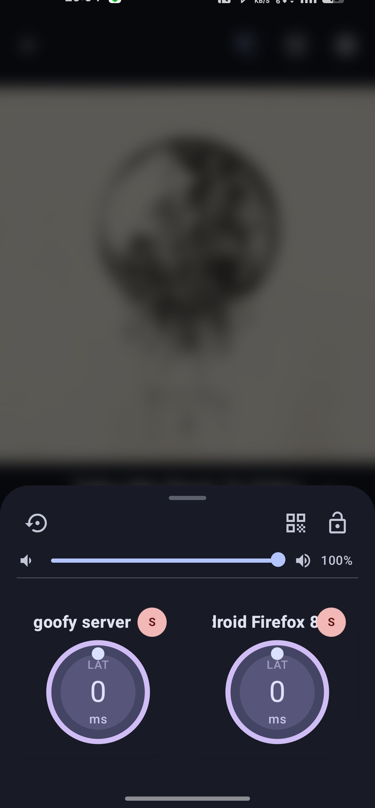
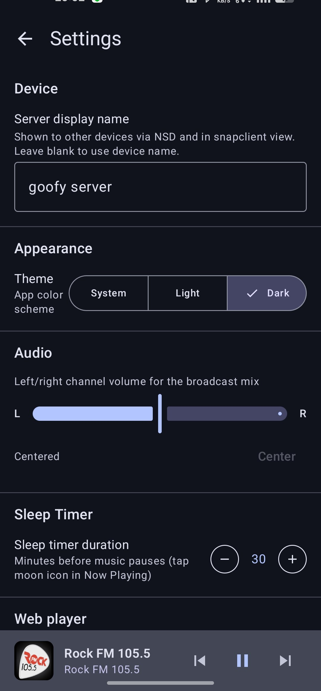

# Quantumcast

An Android internet-radio player: search a global directory of 30,000+ stations
([radio-browser.info](https://www.radio-browser.info)) by name, country, or
genre, shuffle through them on a timer, and see what's playing with track
identification. Broadcasts the audio in sync to any number of
[Snapcast](https://github.com/badaix/snapcast) devices - with a built-in web
player for browser clients, plus per-device volume, latency offset, and
left/right/stereo channel assignment.

## Screenshots

<p align="center">
  
  
  
  
  
</p>

Part of the **capullo-tech** audio platform. Quantumcast is the internet-radio
front-end, being recomposed onto the platform's shared libraries:

- **[capullo-audio](https://github.com/capullo-tech/capullo-audio)** - the
  delivery engine (ExoPlayer → FIFO → Snapcast server/client) and multi-device
  control.
- **[capullo-source-radiobrowser](https://github.com/capullo-tech/capullo-source-radiobrowser)**
  - the Radio Browser source (station search + stream resolution) behind the
  `capullo-audio-contracts` SPI.

## Building

```sh
./gradlew :app:assembleProdDebug
```

The Snapcast native libraries come from
[`lib-snapcast-android`](https://github.com/capullo-tech/lib-snapcast-android)
via jitpack and the
[FFmpeg decoder](https://github.com/capullo-tech/lib-media3-ffmpeg-android) is
bundled - no submodules, nothing to populate.

## License

GPLv3 - see [LICENSE](LICENSE) and [NOTICE](NOTICE).
